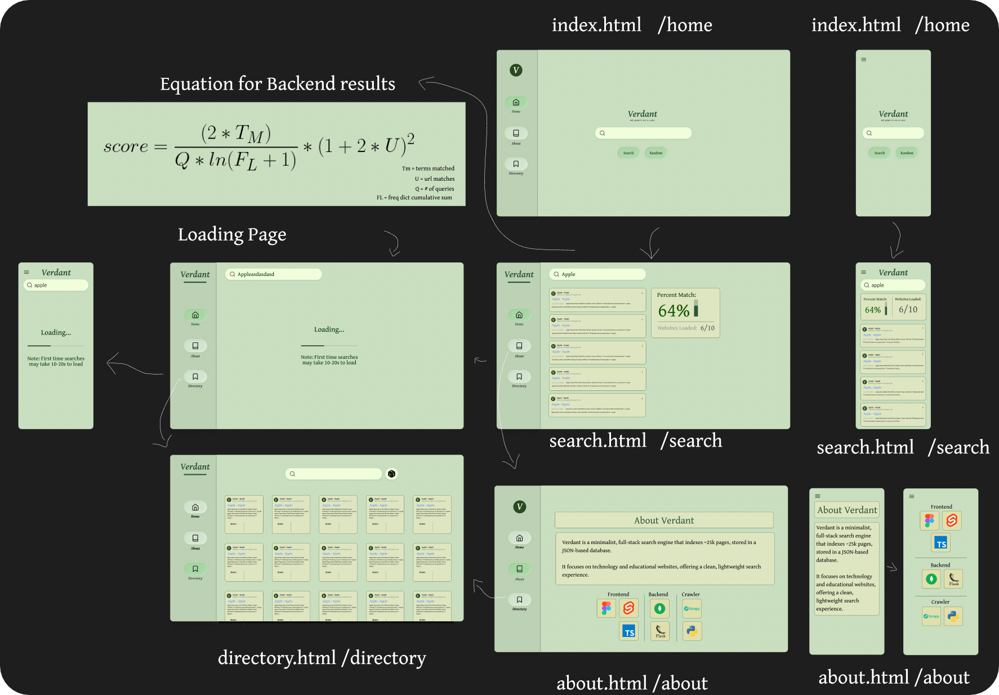

<h1 style="font-size: 48px"><a href="https://verdantsearch.netlify.app">verdant</a> - Complete search engine project</h1>

## Parts
- [Crawler](docs/crawler/README.md) - Web Crawler (Scrapy)
- [Database](docs/database/README.md) - MongoDB Database
- [Backend](docs/backend/README.md) - Backend and Search Query Algorithm
- [Frontend](docs/frontend/README.md) - Sveltekit Frontend
- [website](docs/website/README.md) - Frontend Interface at verdantsearch.netlify.app

## Figma UI Diagram

