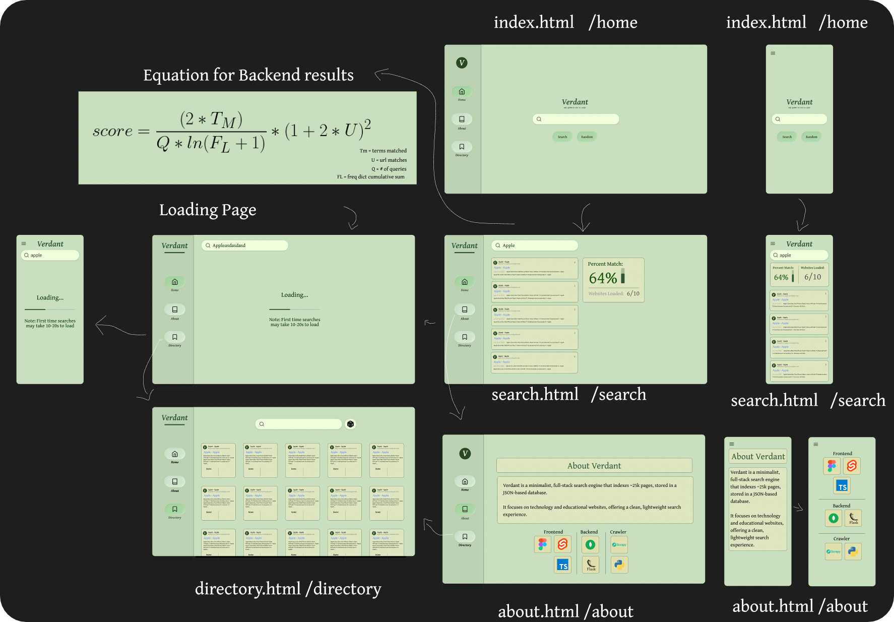

<h1 style="font-size: 48px"><a href="https://verdantsearch.netlify.app">verdant</a> - Semantic search engine project</h1>

## What is Verdant?
Verdant is a semantic search engine, with over 200k chunked and embedded unique pages, stored locally on a rasberry pi + cloudflare tunnels, available with a react frontend here: [Verdant](https://verdantsearch.netlify.app)

## Technologies

## Parts
- [Crawler](docs/crawler/README.md) - Web Crawler (Scrapy)
- [Database](docs/database/README.md) - Postgres Database locally hosted ~200k entries
- [Backend](docs/backend/README.md) - Backend and Search Query Algorithm
- [Frontend](docs/frontend/README.md) - Sveltekit Frontend
- [website](https://verdantsearch.netlify.app) - Frontend Interface at verdantsearch.netlify.app

## Figma UI Diagram

