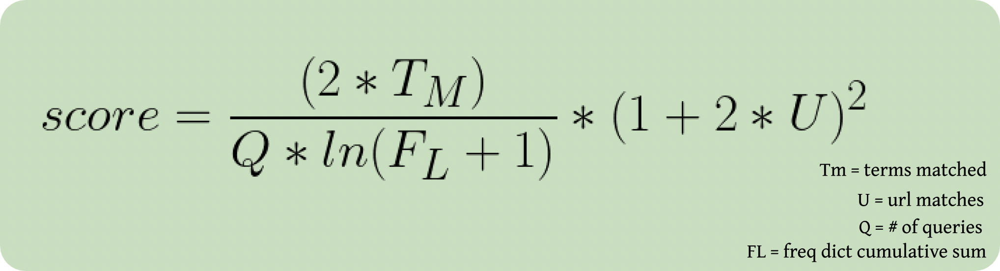

<h1 style="font-size: 48px">verdant backend</h1>

## Technologies

## Steps
<h4>1.) User submits a POST request containing their search queries as parameters (minus common words like the, and, for, etc ) </h4>

<h4>2.) The backend then fetches at most 500 sites that contain matching search queries (the database is small enough that grabbing 500 sites is more than enough even for generic queries.)</h4>

<h4>3.) The 500 sites are each given a score based on the formula below:</h4>

<h5>Note: The formula gives the highest results to sites with a higher % of the most search queries, giving a bonus to sites that have search queries in the URL text.</h5>

<h4>4.) Finally, the backend returns up to 10 of the most relevant sites, and a corresponding match score for the highest match, ranging from 0-100%</h4>
